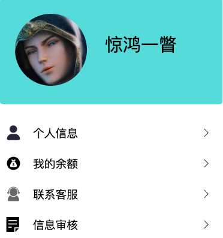
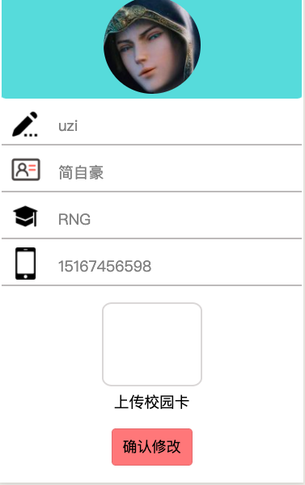
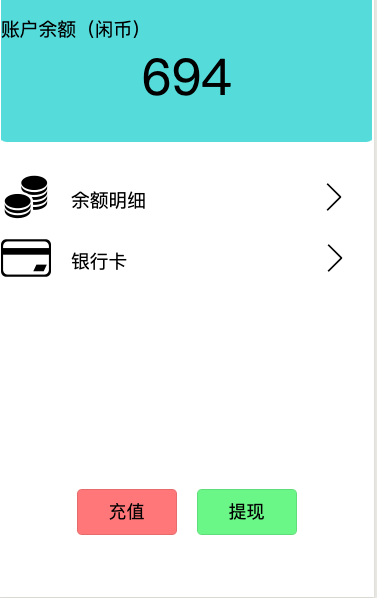

[TOC]

#### 1.发布订单

- **问卷发布**

点击一键发布按钮后选择问卷，进入问卷系统填写问卷基本信息，完成后点击创建问卷：

   

点击左下角tab添加题目，选择题目类型，单选题和多选题填入题目和选项再确认即可，而填空题只需填入题目：

      

题目创建完毕后点击保存按钮即可发布问卷：

- **快递发布**

  - 点击“一键发布”，选择“发布快递”，进入信息填写页面，填写完成后点击确认发布后完成“发布快递”

    

    

- **跑腿发布**

  - 点击“一键发布”，选择“发布跑腿”，进入信息填写页面，填写完成后点击确认发布后完成“发布跑腿”

  

- **求助发布**

  - 点击“一键发布”，选择“发布求助”，进入信息填写页面，填写完成后点击确认发布后完成“发布求助”

  

- **闲置发布**

  - 点击“一键发布”，选择“发布闲置”，进入信息填写页面，填写基本信息并且选择上传闲置物品的图片，完成后点击确认发布后完成“发布闲置”

  

#### 2.接收订单

#### 3.订单管理

点击订单tab进入订单管理页面，选择其中一个按钮可进入相应的个人订单类型页面，然后可以点击上面的tab查看不同的订单类型：

      

对于自己发布的订单（除问卷外），点击列表中的订单可查看详细信息，长按可选择删除该订单：

   

对于发布的问卷，点击列表中的问卷会跳出弹窗，可选择查看问卷内容、问卷结果、终止问卷发布以及删除该问卷：

      

#### 4.表白墙

- 首页显示的是表白墙顶的精选表白，在表白墙置顶表白后可显示在首页

- 点击“写表白”按钮，跳转到“写表白”界面，输入自己想说的话，点击“表白”按钮，发布表白，审核成功后显示在表白墙

#### 5.个人帐户管理

个人账户界面一共包含四个可选项。

- 个人信息

  

  点击“个人信息”选项将会跳转到个人信息界面，

  如果是已经注册过的用户，这里将显示用户的基本信息。

  如果用户尚未注册，则这些信息将显示为空。用户需要如实填写信息完成注册，然后点击确认修改按钮，您的信息将会被后端数据库记录并且生成一个注册申请。

  只有校园卡信息真实的用户才可能注册成功。

- 我的余额

  

  点击“我的余额”选项将会跳转到我的余额界面，

  界面将会显示用户的当前余额。

  页面中部包含两个可选项：余额明细与添加银行卡

  余额明细记录着你的每一笔余额变动记录

  银行卡功能暂未开放

  页面下部包含两个按钮（充值和提现）

  由于未真正绑定银行卡，这里的余额全都是虚拟概念。

- 联系客服

  

  点击“联系客服”选项可以获取客服的联系方式

  请您把对产品的意见和建议都告诉客服哦。

- 信息审核

  

  （图片为管理员登陆情况，目前没有需要认证的用户）
  
  点击“信息审核”将有两种情况：
  
  - 如果您是普通用户，则系统将会提示您信息审核是管理员的特权。
  - 如果系统识别为管理员账户，则管理员可以对提交认证申请的用户给予判断。如果信息正确无误则给予通过，否则拒绝用户注册，系统将会提醒用户重新填写信息。
