[TOC]

### 一、项目环境

* 服务器 操作系统：操作系统：Windows 10 Web服务器：IIS  数据库：MongoDB
* 客户端：微信小程序

### 二、项目构建和管理工具

* 构建 Vue框架进行开发
* 管理 采用GitHub管理平台托管代码

### 三、技术选型

本产品使用“微信小程序”作为用户交互方式，使用Java Spring boot 作为后端开发的框架，服务端使用 MySQL 数据库作为存储媒介，Redis数据库作为内存数据库。整体架构是MVC架构，服务端还使用了面向服务的架构（微服务架构），使用面向对象编程。

#### 理由

##### 开发微信小程序

- 小程序是一种不需要下载安装即可使用的应用，它实现了应用**“触手可及”**的梦想，用户扫一扫或者搜一下即可打开应用。也体现了**“用完即走”**的理念，用户不用关心是否安装太多应用的问题。应用将无处不在，随时可用，但又无需安装卸载。
- 对于开发者而言，小程序开发门槛相对较低，难度不及APP，能够满足简单的基础应用，适合生活服务类线下商铺以及非刚需低频应用的转换。
- 对于个人或创业团队而言，微信小程序的推广成本低，传播性广，微信的10亿用户都将是好的微信小程序的潜在用户。

##### 使用Spring boot

**Spring Boot** 集成了大量常用的第三方库配置，Spring Boot应用中这些第三方库几乎可以是零配置的**开箱即用（out-of-the-box）**，大部分的 Spring Boot 应用都只需要非常少量的配置代码（基于 Java 的配置），开发者能够更加专注于业务逻辑。Spring boot 有以下优点：

- 简化编码：Spring Boot 帮助开发着快速启动一个 web 容器，在 Spring Boot 中，我们只需要在 pom 文件中添加依赖即可。
- 简化配置：Spring Boot 采用 Java Config 的方式对 Spring 进行配置。对于一个普通的类，只需要@Configuration 和@Bean两个注解即可使它也成为一个 Bean 让 Spring 去管理
- 简化部署：Spring Boot 内嵌了 tomcat，我们只需要将项目打成 jar 包，使用启动指令即可一键式启动项目。服务端的运行环境需求也很低，仅需要有JDK即可

##### 使用 MySQL 数据库

- **开源**
- **简单易用** ：MySQL 是一个高性能且相对简单的数据库系统，与一些更大系统的设置和管理相比，其复杂程度较低
- **可移植性** ：MySQL 可运行在各种版本的 UNIX 以及其他非 UNIX 的系统，可移植性强
- **速度** ：MySQL 运行速度很快。开发者声称 MySQL 可能是目前能得到的最快的数据库。

##### 使用Redis数据库

本产品使用Redis主要是用于用户会话状态的维护，因为用户会话频繁且速度要求高，而Mysql数据库的数据存储于硬盘中，从硬盘频繁读取数据本身就是一件不合理的事情，而且性能和效率都不高，因此我们使用了redis 内存数据库

##### 使用MVC架构

- 低耦合性
  视图层和业务层分离，这样就允许更改视图层代码而不用重新编译模型和控制器代码，同样，一个应用的业务流程或者业务规则的改变只需要改动MVC的模型层即可。因为模型与控制器和视图相分离，所以很容易改变应用程序的数据层和业务规则。
- 高重用性和可适用性
  随着技术的不断进步，现在需要用越来越多的方式来访问应用程序。MVC模式允许你使用各种不同样式的视图来访问同一个服务器端的代码。它包括任何WEB（HTTP）浏览器或者无线浏览器（wap），比如，用户可以通过电脑也可通过手机来订购某样产品，虽然订购的方式不一样，但处理订购产品的方式是一样的。由于模型返回的数据没有进行格式化，所以同样的构件能被不同的界面使用。例如，很多数据可能用HTML来表示，但是也有可能用WAP来表示，而这些表示所需要的命令是改变视图层的实现方式，而控制层和模型层无需做任何改变。
- 较低的生命周期成本
  MVC使开发和维护用户接口的技术含量降低。
- 快速的部署
  使用MVC模式使开发时间得到相当大的缩减，它使程序员（Java开发人员）集中精力于业务逻辑，界面程序员（HTML和JSP开发人员）集中精力于表现形式上。
- 可维护性
  分离视图层和业务逻辑层也使得WEB应用更易于维护和修改。
- 有利于软件工程化管理
  由于不同的层各司其职，每一层不同的应用具有某些相同的特征，有利于通过工程化、工具化管理程序代码。

##### 使用微服务架构

- 因为有两位后端开发人员，且负责不同的模块，为了避免后期整合增加的工作量，我们使用微服务的架构和设计理念，即双方通过调用接口来实现程序的完整性，而非将代码整合在一起。通过运行开发和运行多个小的程序模块，来实现产品的功能扩展，提高了平台的可扩展性和可维护性。

### 四、架构设计

本项目的目录结构如下：

##### 前端

```
│  app.js
│  app.json
│  app.wxss
│  project.config.json
│  sitemap.json
│  
├─images
│      .DS_Store
│      Add.png
│      ...      
├─pages
│  │  .DS_Store
│  │  
│  ├─confession
│  │      confession.js
│  │      confession.json
│  │      confession.wxml
│  │      confession.wxss
│  │      confession_expression.js
│  │      confession_expression.json
│  │      confession_expression.wxml
│  │      confession_expression.wxss
│  │      
│  ├─details
│  │      details.js
│  │      details.json
│  │      details.wxml
│  │      details.wxss
│  │      
│  ├─home
│  │      home.js
│  │      home.json
│  │      home.wxml
│  │      home.wxss
│  │      
│  ├─logs
│  │      logs.js
│  │      logs.json
│  │      logs.wxml
│  │      logs.wxss
│  │      
│  ├─orders
│  │  │  orders_menu.js
│  │  │  orders_menu.json
│  │  │  orders_menu.wxml
│  │  │  orders_menu.wxss
│  │  │  
│  │  ├─orders_content
│  │  │  │  order_content.js
│  │  │  │  order_content.json
│  │  │  │  order_content.wxml
│  │  │  │  order_content.wxss
│  │  │  │  
│  │  │  └─questionnaire_result
│  │  │          completion_results.js
│  │  │          completion_results.json
│  │  │          completion_results.wxml
│  │  │          completion_results.wxss
│  │  │          questionnaire-anlyse.js
│  │  │          questionnaire-anlyse.json
│  │  │          questionnaire-anlyse.wxml
│  │  │          questionnaire-anlyse.wxss
│  │  │          
│  │  └─orders_list
│  │          orders_list.js
│  │          orders_list.json
│  │          orders_list.wxml
│  │          orders_list.wxss
│  │          
│  ├─personal
│  │  │  .DS_Store
│  │  │  personal.js
│  │  │  personal.json
│  │  │  personal.wxml
│  │  │  personal.wxss
│  │  │  
│  │  ├─bill
│  │  │      bill.js
│  │  │      bill.json
│  │  │      bill.wxml
│  │  │      bill.wxss
│  │  │      
│  │  ├─check
│  │  │      check.js
│  │  │      check.json
│  │  │      check.wxml
│  │  │      check.wxss
│  │  │      
│  │  ├─my_balance
│  │  │      my_balance.js
│  │  │      my_balance.json
│  │  │      my_balance.wxml
│  │  │      my_balance.wxss
│  │  │      
│  │  ├─my_info
│  │  │      my_info.js
│  │  │      my_info.json
│  │  │      my_info.wxml
│  │  │      my_info.wxss
│  │  │      
│  │  └─service
│  │          service.js
│  │          service.json
│  │          service.wxml
│  │          service.wxss
│  │          
│  ├─publish
│  │      publish.js
│  │      publish.json
│  │      publish.wxml
│  │      publish.wxss
│  │      
│  ├─questionnaire
│  │      create_question.js
│  │      create_question.json
│  │      create_question.wxml
│  │      create_question.wxss
│  │      create_questionnaire.js
│  │      create_questionnaire.json
│  │      create_questionnaire.wxml
│  │      create_questionnaire.wxss
│  │      questionnaire.js
│  │      questionnaire.json
│  │      questionnaire.wxml
│  │      questionnaire.wxss
│  │      
│  └─receipt
│          receipt.js
│          receipt.json
│          receipt.wxml
│          receipt.wxss
│          
└─utils
        util.js
```

##### 后端

zdx部分

```
│  2129067.pfx
│  3.1 用户信息更新.md
│  demo.iml
│  mvnw
│  mvnw.cmd
│  pom.xml
│  
├─.idea
│  │  .name
│  │  compiler.xml
│  │  encodings.xml
│  │  misc.xml
│  │  modules.xml
│  │  vcs.xml
│  │  workspace.xml
│  │  
│  ├─artifacts
│  │      demo_jar.xml
│  │      
│  └─libraries
│          Maven__ch_qos_logback_logback_classic_1_2_3.xml
│          ...
├─.mvn
│  └─wrapper
│          maven-wrapper.jar
│          maven-wrapper.properties
│          MavenWrapperDownloader.java
│          
├─src
│  ├─main
│  │  ├─java
│  │  │  ├─com
│  │  │  │  └─example
│  │  │  │      └─demo
│  │  │  │              DemoApplication.java
│  │  │  │              History.java
│  │  │  │              HistoryController.java
│  │  │  │              LoveWall.java
│  │  │  │              LoveWallController.java
│  │  │  │              SchoolCard.java
│  │  │  │              SwaggerController.java
│  │  │  │              User.java
│  │  │  │              UserController.java
│  │  │  │              
│  │  │  └─META-INF
│  │  │          MANIFEST.MF
│  │  │          
│  │  └─resources
│  │          application.properties
│  │          application.yml
│  │          
│  └─test
│      └─java
│          └─com
│              └─example
│                  └─demo
│                          DemoApplicationTests.java
│                          
└─target
    │  demo-0.0.1-SNAPSHOT.jar
    │  demo-0.0.1-SNAPSHOT.jar.original
    │  upload.bat
    │  
    ├─classes
    │  │  application.properties
    │  │  application.yml
    │  │  
    │  └─com
    │      └─example
    │          └─demo
    │                  DemoApplication.class
    │                  History.class
    │                  HistoryController.class
    │                  LoveWall.class
    │                  LoveWallController.class
    │                  SchoolCard.class
    │                  SwaggerController.class
    │                  User.class
    │                  UserController$createid.class
    │                  UserController.class
    │                  
    ├─generated-sources
    │  └─annotations
    ├─generated-test-sources
    │  └─test-annotations
    ├─maven-archiver
    │      pom.properties
    │      
    ├─maven-status
    │  └─maven-compiler-plugin
    │      ├─compile
    │      │  └─default-compile
    │      │          createdFiles.lst
    │      │          inputFiles.lst
    │      │          
    │      └─testCompile
    │          └─default-testCompile
    │                  createdFiles.lst
    │                  inputFiles.lst
    │                  
    ├─surefire-reports
    │      2019-05-17T22-41-33_358-jvmRun1.dump
    │      2019-05-31T19-51-29_165-jvmRun1.dump
    │      2019-06-08T15-08-00_441-jvmRun1.dump
    │      com.example.demo.DemoApplicationTests.txt
    │      TEST-com.example.demo.DemoApplicationTests.xml
    │      
    └─test-classes
        └─com
            └─example
                └─demo
                        DemoApplicationTests.class
                        

```

ljh部分

```
│  2129067.pfx
│  3.1 用户信息更新.pdf
│  666
│  mvnw
│  mvnw.cmd
│  mysql.c
│  pom.xml
│  接口文件.md
│  接口文件1.1.md
 |  *.md
│  文档结构图.txt
│  问卷设计.json
│  
├─.mvn
│  └─wrapper
│          maven-wrapper.jar
│          maven-wrapper.properties
│          MavenWrapperDownloader.java
│          
├─assets
│      20190602001825867.png
│      
├─out
│  └─artifacts
│      └─BackEnd1_jar
│              BackEnd1.jar
│              ...
│              
├─src
│  ├─main
│  │  ├─java
│  │  │  └─backend1
│  │  │      └─demo
│  │  │              AcceptController.java
│  │  │              answer.java
│  │  │              Contact.java
│  │  │              CreateController.java
│  │  │              createid.java
│  │  │              CreateService.java
│  │  │              DemoApplication.java
│  │  │              DetailController.java
│  │  │              errand.java
│  │  │              errand_detail.java
│  │  │              expressage.java
│  │  │              expressage_detail.java
│  │  │              for_help.java
│  │  │              for_help_detail.java
│  │  │              IssueInfoImpl.java
│  │  │              IssueInfoMapper.java
│  │  │              LoadController.java
│  │  │              LoadImpl.java
│  │  │              LoadMapper.java
│  │  │              LoadQuestion.java
│  │  │              LoadSerivce.java
│  │  │              OpenidReq.java
│  │  │              privateInfo.java
│  │  │              question.java
│  │  │              questionair.java
│  │  │              req.java
│  │  │              second_hand.java
│  │  │              second_hand_detail.java
│  │  │              SwaggerController.java
│  │  │              
│  │  └─resources
│  │      │  application.properties
│  │      │  application.yml
│  │      │  
│  │      └─META-INF
│  │              MANIFEST.MF
│  │              
│  └─test
│      └─java
│          └─backend1
│              └─demo
│                      DemoApplicationTests.java
│                      questionairTest.java
│                      
└─temp
    └─target
        │  demo-0.0.1-SNAPSHOT.jar
        │  demo-0.0.1-SNAPSHOT.jar.original
        │  
        ├─classes
        │  │  application.properties
        │  │  application.yml
        │  │  
        │  ├─backend1
        │  │  └─demo
        │  │          AcceptController.class
        │  │          answer.class
        │  │          Contact.class
        │  │          CreateController.class
        │  │          createid.class
        │  │          CreateService.class
        │  │          DemoApplication.class
        │  │          DetailController.class
        │  │          errand.class
        │  │          errand_detail.class
        │  │          expressage.class
        │  │          expressage_detail.class
        │  │          for_help.class
        │  │          for_help_detail.class
        │  │          IssueInfoImpl.class
        │  │          IssueInfoMapper.class
        │  │          LoadController.class
        │  │          LoadImpl.class
        │  │          LoadMapper.class
        │  │          LoadQuestion.class
        │  │          LoadSerivce.class
        │  │          OpenidReq.class
        │  │          privateInfo.class
        │  │          question.class
        │  │          questionair.class
        │  │          req.class
        │  │          second_hand.class
        │  │          second_hand_detail.class
        │  │          SwaggerController.class
        │  │          
        │  └─META-INF
        │          MANIFEST.MF
        │          
        ├─maven-archiver
        │      pom.properties
        │      
        ├─maven-status
        │  └─maven-compiler-plugin
        │      ├─compile
        │      │  └─default-compile
        │      │          createdFiles.lst
        │      │          inputFiles.lst
        │      │          
        │      └─testCompile
        │          └─default-testCompile
        │                  createdFiles.lst
        │                  inputFiles.lst
        │                  
        ├─surefire-reports
        │      backend1.demo.DemoApplicationTests.txt
        │      TEST-backend1.demo.DemoApplicationTests.xml
        │      
        └─test-classes
            └─backend1
                └─demo
                        DemoApplicationTests.class
                        questionairTest.class
                        
```

文件上下传部分

```
│  mvnw
│  mvnw.cmd
│  pom.xml 
├─.mvn
│  └─wrapper
│          maven-wrapper.jar
│          maven-wrapper.properties
│          MavenWrapperDownloader.java
│          
├─image
│      4a526b47-3a34-4e4f-ae9a-59541c86246c小程序登陆流程图.png
│      
├─META-INF
│      MANIFEST.MF
│      
├─out
│  └─artifacts
│      └─fileLoad_jar
│              classmate-1.4.0.jar
│              ...
│              
└─src
    ├─main
    │  ├─java
    │  │  └─file
    │  │      ├─load
    │  │      │  ├─demo
    │  │      │  │      DemoApplication.java
    │  │      │  │      fileController.java
    │  │      │  │      
    │  │      │  └─META-INF
    │  │      │          MANIFEST.MF
    │  │      │          
    │  │      └─META-INF
    │  │              MANIFEST.MF
    │  │              
    │  └─resources
    │          application.properties
    │          cer.pfx
    │          pfx-password.txt
    │          
    └─test
        └─java
            └─file
                └─load
                    └─demo
                            DemoApplicationTests.java
                            

```

业务逻辑架构图：

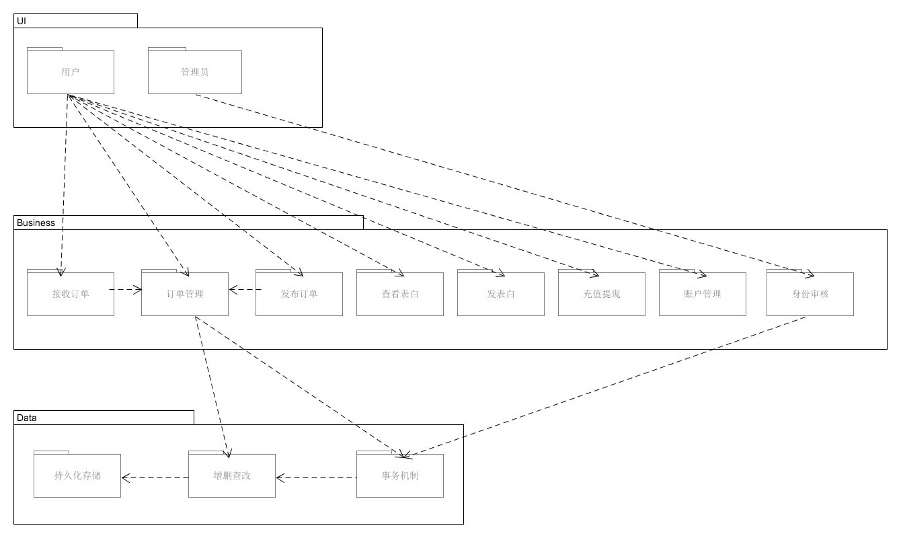

### 五、模块划分与设计

#### 系统整体模块图

本项目系统总体由登录模块、发布订单模块、接收订单模块、订单管理模块、用户模块、表白墙模块这六大模块组成。


##### 1.登录模块划分

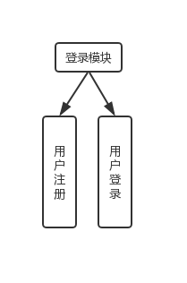

登录模块包括用户注册和用户登录两部分，第一次进入小程序需要微信授权进行注册，随后每次进入系统都会自动以该微信账户登录（代码位于code/moneydog/FrontEnd/mongeydog/page/home）

##### 2.订单发布模块划分

- 订单发布模块包括发布快递、发布求助、发布跑腿、发布闲置、发布问卷五个业务，在主页点击“一键发布”，即可选择发布模块进行发布订单

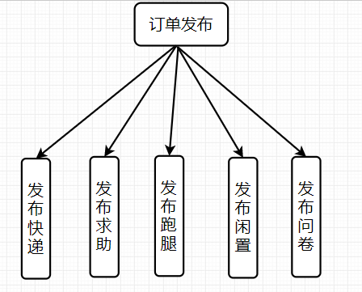

##### 3.接收订单模块划分

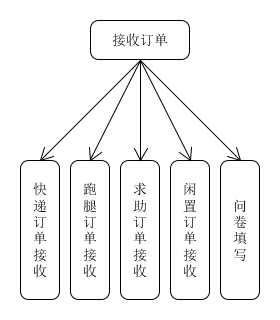

##### 4.订单管理模块划分

##### 5.用户模块划分


- 5.1个人信息

  基本信息包括名字，昵称，学校，联系方式，此外校园卡信息是用户认证的关键。

  

- 5.2我的余额

  包括余额显示，余额账单，充值，提现，绑定银行卡（虚拟功能）

  

- 5.3联系客服

  普通用户可以获取客服的联系方式，管理员可以修改客服信息。

  

- 5.4信息审核

  管理员可以对用户的认证申请进行审核，也可以修改客服信息。


##### 6.表白墙模块划分


- 表白墙有三个子模块：精选表白、发布表白、表白墙显示。精选表白显示的是表白墙置顶的精选表白，发布表白编写表白内容，表白内容审核通过后可在表白墙显示

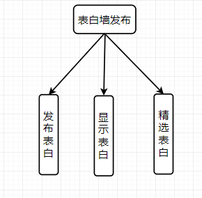
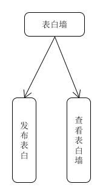

### 六、数据库设计
### 数据库设计原则：
一个好的数据库产品并不等于就是有一个好的应用系统，假设不能设计一个逻辑合理的数据库模型，不仅仅会增加程序客户端和服务器端的编程与维护的难度，而且还会大大影响系统在实际操作运行的性能。 
数据库设计的两种方法:
(1)面向数据:以信息需求为主，同时兼顾处理需求;

(2)面向过程:以处理需求为主，同时兼顾信息需求。

数据库设计是建立数据库和应用系统的核心和基础，它要求对于一个给定的应用环境，构造最优的数据库模式，建立一个数据库应用系统，该系统可以有效地存储数据，满足用户的应用需求。
### 数据库 E-R 图：
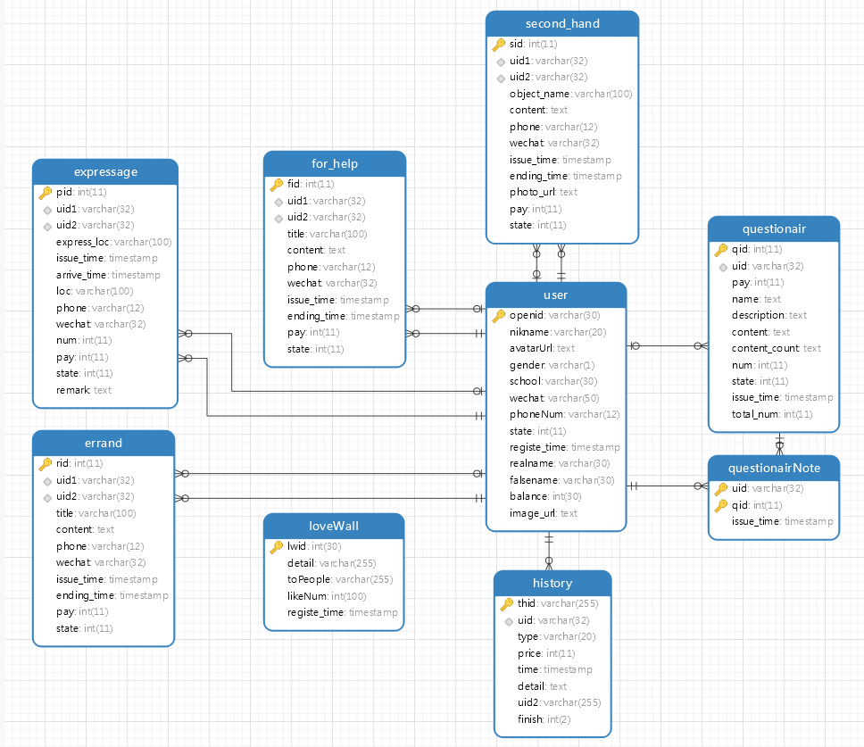  

### 七、路由设计

#### 1.返回状态码

|        类型         | stateCode |   info   |
| :-----------------: | :-------: | :------: |
|    请求操作成功     |    200    |   NULL   |
| 成功GET且文件未改变 |    304    |   NULL   |
|    数据格式错误     |    400    |   NULL   |
|        错误         |    500    | 错误信息 |

#### 2. 路由表格

| 方法 |         路由          |    说明     | 测试 |
| :--: | :-------------------: | :---------: | :--: |
|PUT | /Modified/AcceptIssue  |	Accept Issue |OK|
|PUT |  /Modified/DeleteIssue | 	Delete Issue |OK|
|PUT |/Modified/FinishIssue		|Finish Issue |OK|
|GET |/Create/DeleteQuestionair	|	删除问卷 |OK|
|GET |/Create/downLoadQuestionair |	downLoad Questionair |OK|
|GET |/Create/EndQuestion |用户终止订单，用户收集到足够多的订单后，终止问卷 |OK|
|POST| /Create/Errand |Create Errand |OK|
|POST| /Create/Expressage| Create Expressage |OK|
|POST| /Create/fill |                     填写问卷                     |OK|
|POST| /Create/For_help |Create For_help |OK|
|GET |/Create/getQuestionairContent| get Questionair Content |OK|
|GET |/Create/LoadMyQuestionair |Load My Questionair |OK|
|POST |/Create/Login |Login |OK|
|GET |/Create/OnLoadQuestionair| OnLoad Questionair |OK|
|POST |/Create/questionair |create |OK|
|POST|/Create/Second_hand |Create Second_hand |OK|
|POST |/Create/User |Create User |OK|
|GET |/Create/viewAll| 发布者获取问卷填写统计：人数，内容统计等 |OK|
|GET |/forever/cc |forever Session |OK|
|GET |/Load/Contact_way |get Contact |OK|
|GET |/Load/Creation| Load MyCreation |OK|
|GET| /Load/downLoadErrands |downLoad Errands |OK|
|GET| /Load/downLoadExpressage |downLoad  Expressage |OK|
|GET |/Load/downLoadFor_help |downLoad  For_help |OK|
|GET |/Load/downLoadSecond_hand |downLoadSecond_hand |OK|
|GET |/Load/OnLoadErrands |OnLoad  Errands |OK|
|GET |/Load/OnLoadExpressage| OnLoad  Expressage |OK|
|GET |/Load/OnLoadFor_help |OnLoad  For_help |OK|
|GET |/Load/OnLoadSecond_hand| OnLoad Second_hand |OK|
|GET |/Load/Receiving |Load MyReceiving |OK|
| POST | /History/changePower | 改变余额 |OK|
|  POST | /History/createHistory    |  创建余额明细记录        |OK|
|  GET   | /History/getHistory  |  获取余额明细        |OK|
| POST | /LoveWall/createWall | 创建表白墙 |OK|
|  GET    | /LoveWall/getLoveWall |  获取表白墙        |OK|
|  POST   | /LoveWall/likeLoveWall  |  表白墙点赞        |OK|
| POST | /User/changeState | 更改其认证状态 |OK|
|  GET  | /User/getUnstated   |  获取未认证的用户        |OK|
|  GET  | /User/Info   |  获取用户资料        |OK|
| GET | /User/queryPower | 查询闲钱币 |OK|
|  POST   | /User/setPower  |  设置闲钱币       |OK|
|  POST   | /User/Update  |  完善信息        |OK|


#### 3.API示例说明—用户创建问卷

**3.1.应用场景**

用户在订单页面选择自己想要接受的订单

**3.2.接口示例**

https://moneydog.club:3030/Create/questionair

**3.3.是否需要证书**

需要

**3.4.请求参数**

| 字段名 | 变量名 | 必填 | 类型 | 示例值 | 描述 |
| ------ | ------ | ---- | ---- | ------ | ---- |
| 题目内容 | content | 是| string| [{"type":0,"title":"对饭堂的满意度","a":"不满意","b":"一般","c":"较满意","d":"满意"},{"type":1,"title":"喜欢窗口","a":"不满意","b":"一般","c":"较满意","d":"满意"},{"type":2,"title":"对饭堂的建议","a":"","b":"","c":"","d":""}] | 问卷题目 |
| 问卷初始化统计 | content_count |是|string|{"content_count":[                  {"type":0,"a":0,"b":0,"c":0,"d":0,"fill":""},{"type":1,"a":0,"b":0,"c":0,"d":0,"fill":""},{"type":2,"a":0,"b":0,"c":0,"d":0,"fill":""}]                                          }| 问卷统计 |
|描述|description|否|string| 饭堂满意度调查                                               |描述|
|问卷名称|name|是|string| 饭堂满意度调查                                               |问卷名称|
|单价|pay|是|int|1|单价|
|总数|total_num|是|int|100|总是|

**3.5.举例如下**
```
questionair {
content:[{"type":0,"title":"对饭堂的满意度","a":"不满意","b":"一般","c":"较满意","d":"满意"},{"type":1,"title":"喜欢窗口","a":"不满意","b":"一般","c":"较满意","d":"满意"},{"type":2,"title":"对饭堂的建议","a":"","b":"","c":"","d":""}],
content_count:{"content_count":[                  {"type":0,"a":0,"b":0,"c":0,"d":0,"fill":""},{"type":1,"a":0,"b":0,"c":0,"d":0,"fill":""},{"type":2,"a":0,"b":0,"c":0,"d":0,"fill":""}]
},
description:饭堂满意度调查,
name:饭堂满意度调查,
pay:1
total_num:100
 } 
```

**3.6.返回结果**  

|   字段名   | 变量名 | 必填 |    类型     | 示例值  |       描述       |
| :--------: | :----: | :--: | :---------: | :-----: | :--------------: |
| 返回状态码 | result |  是  | JSON String | SUCCESS | 接受订单操作成功 |


### 八、功能模型及用例设计

##### 1.功能模型

**验证用户信息：**

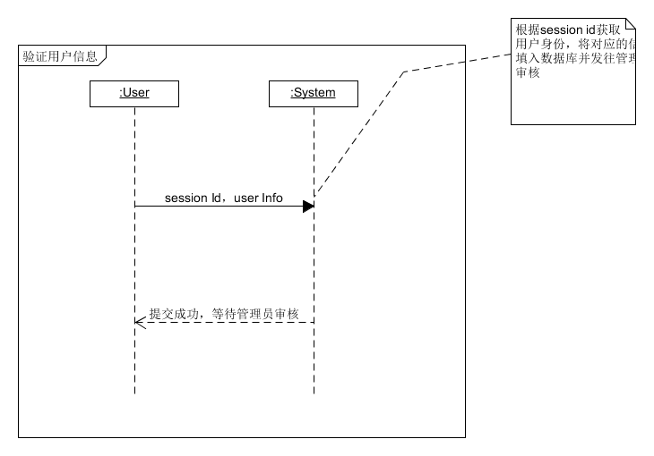

**发布订单：**

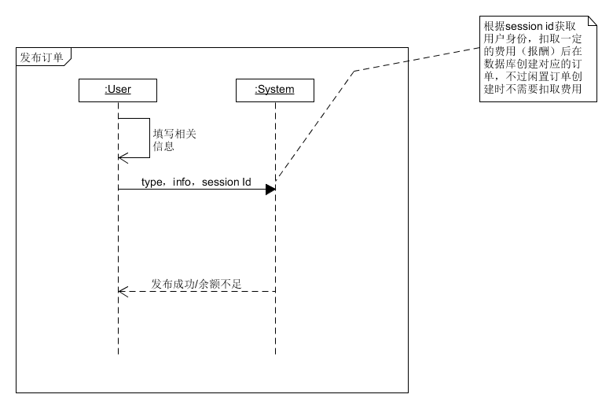

**接收订单：**

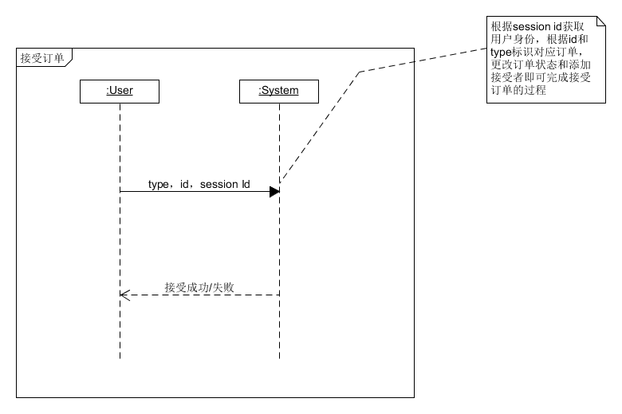

**管理员审核：**

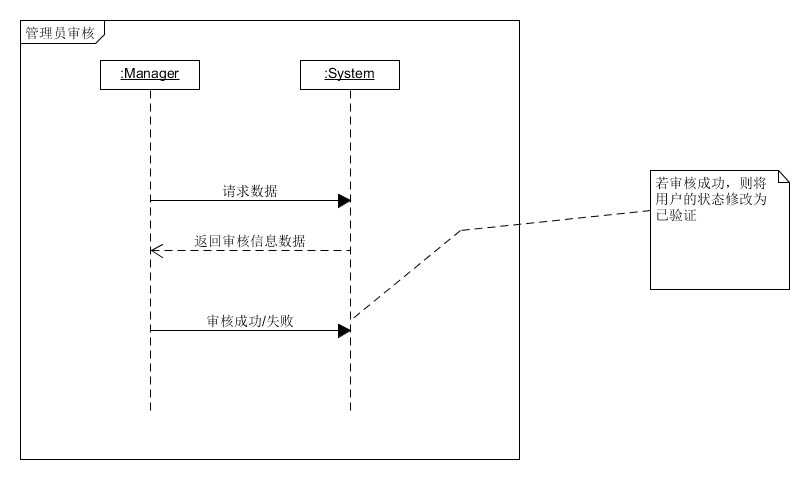

**删除订单：**

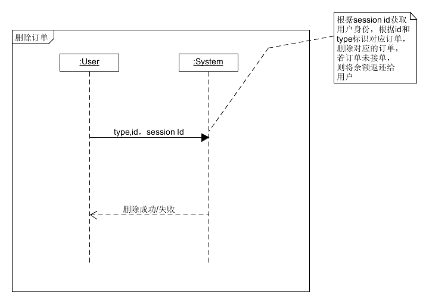

**确认订单完成：**

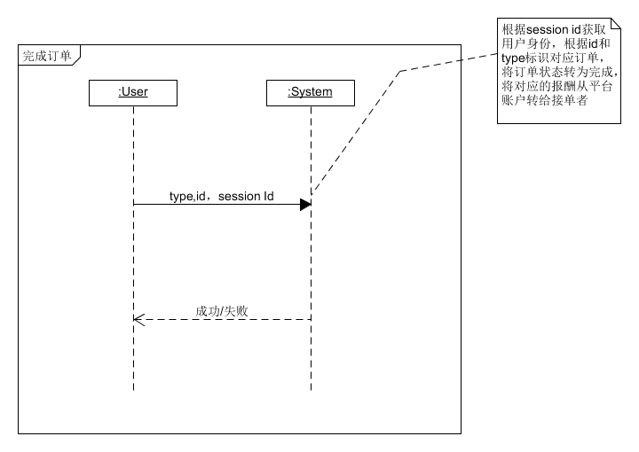

**问卷统计：**

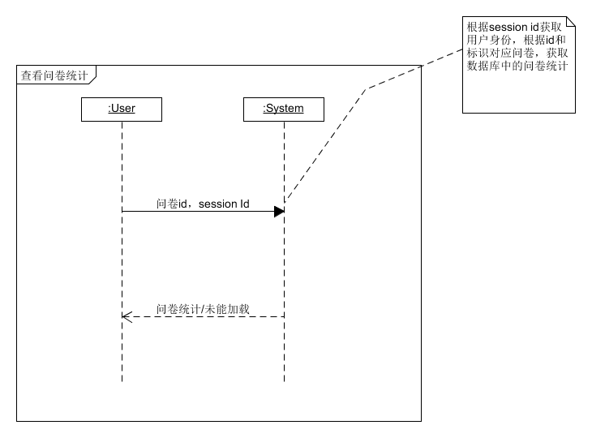


##### 2.用例设计

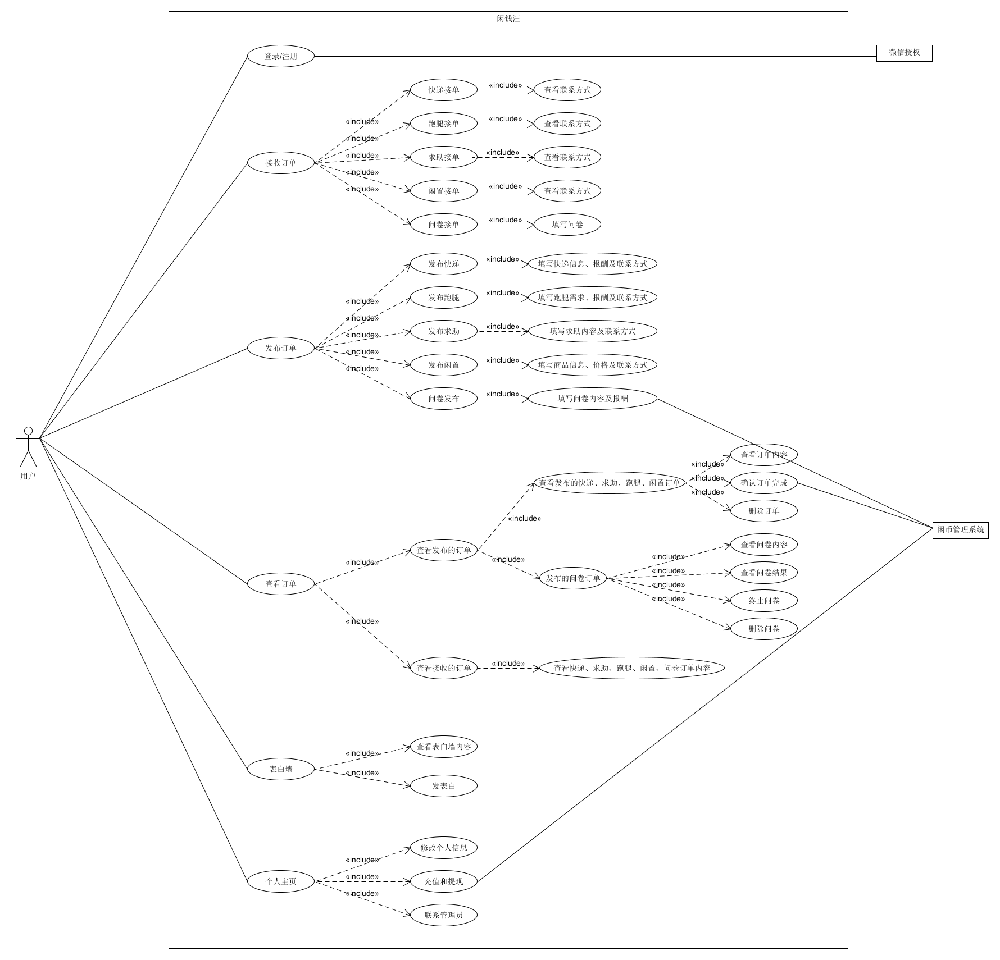

### 九、逻辑视图

我们的闲钱汪系统采用的是经典的分层架构，主要分为UI层，业务层以及数据层


### 十、物理视图

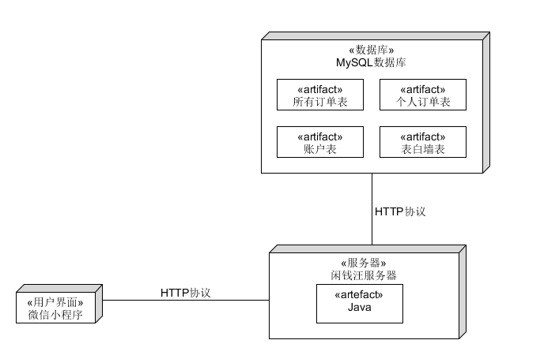

### 十一、技术备忘录

**架构问题：可用性——订单被接单后发布者无法取消或者接单者无法取消接单**

* 解决方案：在前端部分为已被接单的订单提供一个取消按钮，无论是发布者还是接单者选择取消后，便给另一方发送请求取消信息，等另一方同意后便可成功取消订单

* 动机：生活总是有许多变化，方便用户取消才能使用户更满意。

### 十二、设计技术

- **MVC架构**

  view 是指前端，后端的接口开发使用Contorller作为控制器，调用service，接口的implement与service 分离使代码更具维护性

  位置：`code\moneydog\BackEnd\BackEnd1\src\main\java\backend1\demo`

  

- **面向服务的架构（微服务）**

  因为有两位后端开发人员，且负责不同的模块，为了避免后期整合增加的工作量，我们使用微服务的架构和设计理念，即双方通过调用接口来实现程序的完整性，而非将代码整合在一起。通过运行开发和运行多个小的程序模块，来实现产品的功能扩展，提高了平台的可扩展性和可维护性。

  位置：`code\moneydog\BackEnd\BackEnd1\src\main\java\backend1\demo\CreateController` 334 行

  

- **面向对象编程**

  程序多处使用类和类对象，实现面向对象编程， 提高代码的可重用性和可维护性

  位置：`code\moneydog\BackEnd\BackEnd1\src\main\java\backend1\demo\`

  - errand_detail.class  

   

  - answer.class 

  

  - LoadImpl.class   25 行:

    
