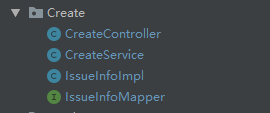
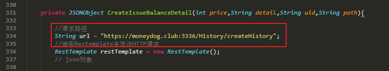
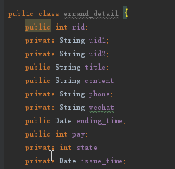
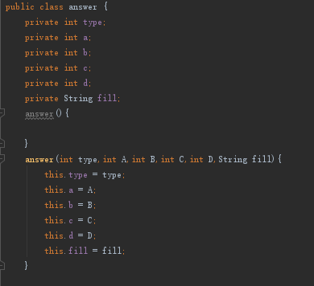
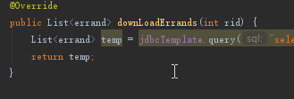

[TOC]

## 技术选型理由

本产品使用“微信小程序”作为用户交互方式，使用Java Spring boot 作为后端开发的框架，服务端使用 MySQL 数据库作为存储媒介，Redis数据库作为内存数据库。整体架构是MVC架构，服务端还使用了面向服务的架构（微服务架构），使用面向对象编程。

## 理由

### 开发微信小程序

- 小程序是一种不需要下载安装即可使用的应用，它实现了应用**“触手可及”**的梦想，用户扫一扫或者搜一下即可打开应用。也体现了**“用完即走”**的理念，用户不用关心是否安装太多应用的问题。应用将无处不在，随时可用，但又无需安装卸载。
- 对于开发者而言，小程序开发门槛相对较低，难度不及APP，能够满足简单的基础应用，适合生活服务类线下商铺以及非刚需低频应用的转换。
- 对于个人或创业团队而言，微信小程序的推广成本低，传播性广，微信的10亿用户都将是好的微信小程序的潜在用户。

### 使用Spring boot

**Spring** Boot 集成了大量常用的第三方库配置，Spring Boot应用中这些第三方库几乎可以是零配置的**开箱即用（out-of-the-box）**，大部分的 Spring Boot 应用都只需要非常少量的配置代码（基于 Java 的配置），开发者能够更加专注于业务逻辑。Spring boot 有以下优点：

- 简化编码：Spring Boot 帮助开发着快速启动一个 web 容器，在 Spring Boot 中，我们只需要在 pom 文件中添加依赖即可。
- 简化配置：Spring Boot 采用 Java Config 的方式对 Spring 进行配置。对于一个普通的类，只需要@Configuration 和@Bean两个注解即可使它也成为一个 Bean 让 Spring 去管理
- 简化部署：Spring Boot 内嵌了 tomcat，我们只需要将项目打成 jar 包，使用启动指令即可一键式启动项目。服务端的运行环境需求也很低，仅需要有JDK即可

### 使用 MySQL 数据库

- **开源**
- **简单易用** ：MySQL 是一个高性能且相对简单的数据库系统，与一些更大系统的设置和管理相比，其复杂程度较低
- **可移植性** ：MySQL 可运行在各种版本的 UNIX 以及其他非 UNIX 的系统，可移植性强
- **速度** ：MySQL 运行速度很快。开发者声称 MySQL 可能是目前能得到的最快的数据库。

### 使用Redis数据库

本产品使用Redis主要是用于用户会话状态的维护，因为用户会话频繁且速度要求高，而Mysql数据库的数据存储于硬盘中，从硬盘频繁读取数据本身就是一件不合理的事情，而且性能和效率都不高，因此我们使用了redis 内存数据库

### 使用MVC架构

- 低耦合性
  　　视图层和业务层分离，这样就允许更改视图层代码而不用重新编译模型和控制器代码，同样，一个应用的业务流程或者业务规则的改变只需要改动MVC的模型层即可。因为模型与控制器和视图相分离，所以很容易改变应用程序的数据层和业务规则。
- 高重用性和可适用性
  　　随着技术的不断进步，现在需要用越来越多的方式来访问应用程序。MVC模式允许你使用各种不同样式的视图来访问同一个服务器端的代码。它包括任何WEB（HTTP）浏览器或者无线浏览器（wap），比如，用户可以通过电脑也可通过手机来订购某样产品，虽然订购的方式不一样，但处理订购产品的方式是一样的。由于模型返回的数据没有进行格式化，所以同样的构件能被不同的界面使用。例如，很多数据可能用HTML来表示，但是也有可能用WAP来表示，而这些表示所需要的命令是改变视图层的实现方式，而控制层和模型层无需做任何改变。
- 较低的生命周期成本
  　　MVC使开发和维护用户接口的技术含量降低。
- 快速的部署
  　　使用MVC模式使开发时间得到相当大的缩减，它使程序员（Java开发人员）集中精力于业务逻辑，界面程序员（HTML和JSP开发人员）集中精力于表现形式上。
- 可维护性
  　　分离视图层和业务逻辑层也使得WEB应用更易于维护和修改。
- 有利于软件工程化管理
  　　由于不同的层各司其职，每一层不同的应用具有某些相同的特征，有利于通过工程化、工具化管理程序代码。

 ### 使用微服务架构

- 因为有两位后端开发人员，且负责不同的模块，为了避免后期整合增加的工作量，我们使用微服务的架构和设计理念，即双方通过调用接口来实现程序的完整性，而非将代码整合在一起。通过运行开发和运行多个小的程序模块，来实现产品的功能扩展，提高了平台的可扩展性和可维护性。

## 架构设计

## 模块划分

## 软件设计技术

- mvc架构

  view 是指前端，后端的接口开发使用Contorller作为控制器，调用service，接口的implement与service 分离使代码更具维护性

  位置：`code\moneydog\BackEnd\BackEnd1\src\main\java\backend1\demo`

  

- 面向服务的架构（微服务）

  因为有两位后端开发人员，且负责不同的模块，为了避免后期整合增加的工作量，我们使用微服务的架构和设计理念，即双方通过调用接口来实现程序的完整性，而非将代码整合在一起。通过运行开发和运行多个小的程序模块，来实现产品的功能扩展，提高了平台的可扩展性和可维护性。

  位置：`code\moneydog\BackEnd\BackEnd1\src\main\java\backend1\demo\CreateController` 334 行

  

- 面向对象编程

  程序多处使用类和类对象，实现面向对象编程， 提高代码的可重用性和可维护性

  位置：`code\moneydog\BackEnd\BackEnd1\src\main\java\backend1\demo\`

  - errand_detail:

   

  - answer

  
  
  - LoadImpl
  
    