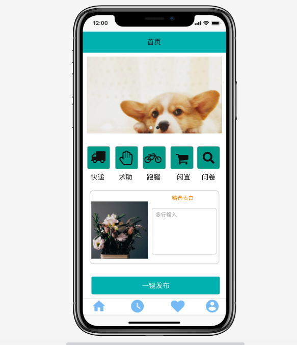
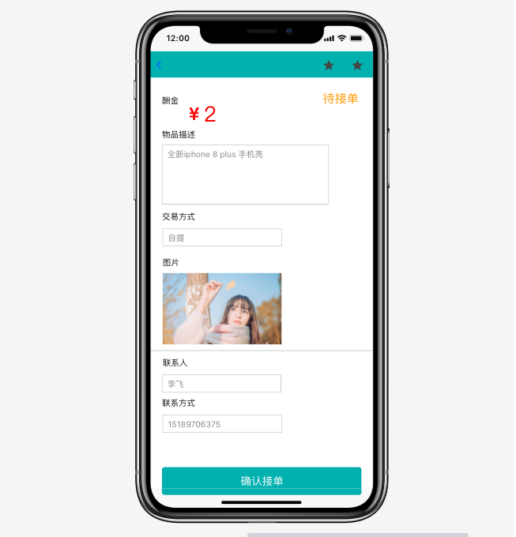
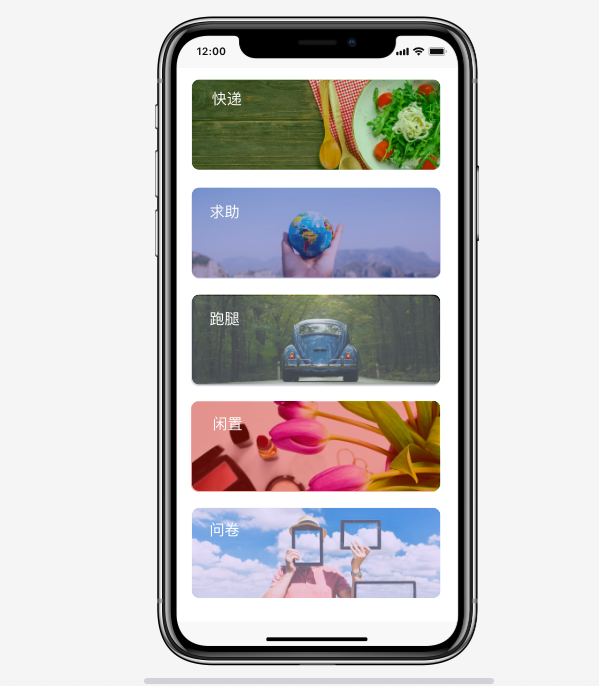

# 7.1UI-design

##### UI原型预览(免费版一个项目最多只支持20个页面，所以建了两个项目)

* [UI原型1](https://org.modao.cc/app/828d105f1d4201458af4ec21637a73c4)
* [UI原型2](https://org.modao.cc/app/f069ca7851109278a0423ecbe6e67b62)

##### 主要功能界面（更多详细预览请查看github上面的view文件夹）

##### 配色方案

* 主题色：#78D8D8

* 其他配色：#1C88E5，#87CEFA

* 按钮配色：red，green，

##### 布局规范

* 页面左右边距：10rpx 
* 主要内容字体：15pt
* 描述字体：10pt

##### 设计说明

* UI设计的三个阶段：

  第一版属于从0到1的过程，由于没有经验，所以第一版的UI基本上是参照一些互助类小程序的风格样式，结合我们自己需要实现的功能，设计出了第一版比较简易的UI界面。总体的风格只是把所需要实现功能的布局固定下来，毫无美感可言。甚至在实现过程中发现一些布局不是很合理，在实现过程中也有了一些小小的改动。

  第二个阶段是需要添加问卷设计和特色功能，这里的特色功能我们选择了表白墙。问卷的UI设计参照问卷星，对其中一些功能实现了简化，表白墙参照了具有这种功能的公众号页面，添加了我们自己的元素，让整个页面显得更加活泼。有了之前的经验，这次的UI界面比之前的多了一些细节。同时我们也发现了整个页面的风格不太统一。

  第三阶段是在我们基本完成了所有的功能实现之后，觉得有必要对UI进行一次升级。这次是比较大的改动。我们确定整体风格以冷色调为主，加入了更多的艺术元素，也对不合理的布局进行了调整，最后的视觉效果也确实提升了很多。

* 参考文档：[微信小程序官方设计规范](<https://www.ui.cn/detail/216120.html>)

  