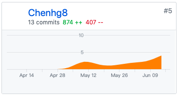

### 个人总结：

作为整个项目的UI设计师和前端工程师，我所做的工作主要是对UI的不断修改和前端代码的开发。

对UI设计工作最大的感受就是这份工作确实需要很多的艺术功底，作为一个毫无艺术感而言的直男来说，想要做好这份工作是无比艰难的。做出了第一版UI之后被队友无比的嫌弃，没办法我只能去参考一些同类的软件风格，不断调整修改，最后也算是交出了一份令队友满意的答案。

前端代码的开发给我的感觉不是很困难，得益于队友的帮助和微信官方详细的文档，这部分的工作比起UI设计来说挑战要小一些。

选择微信小程序是应为我们的组长有过开发小程序的经验，他总是很耐心的给我们讲解不懂的地方，避免了我们自己去踩坑，在开发过程中不定时提醒我们的开发进度，作业压力大时也会让我们暂停工作，可以说是一位很负责任又善解人意的组长了。

其他的组员也对我帮助很大，无私奉献学习视频，不定期的分享一些技术博客，对一些问题的共同商量解决。感谢我有一群可爱的队友。

## PSP2.1统计表

| PSP阶段                    | 耗时(h) |
| -------------------------- | ------- |
| **计划**                   | **4**   |
| · 估计任务时间             | 4       |
| **开发**                   | **70**  |
| · 分析需求                 | 0       |
| · 生成设计文档             | 5       |
| · 设计复审                 | 5       |
| · 代码规范                 | 2       |
| · 具体设计                 | 4       |
| · 具体编码                 | 45      |
| · 代码复审                 | 4       |
| · 测试                     | 5       |
| **报告**                   | **10**  |
| ·测试报告                  | 4       |
| ·计算工作量                | 1       |
| 事后总结，提出过程改进计划 | 5       |
| **合计**                   | 84      |

### Git统计报告

### 工作清单

UI原型的设计和修改

UI设计文档的编写

产品特性文档的编写

项目愿景文档的编写

前端代码个人界面的编写（包括个人基本信息管理，余额管理，联系客服，信息审核等功能）

### 博客清单

[Chenhg8的踩坑报告](https://blog.csdn.net/qq_36325348/article/details/93005397)

