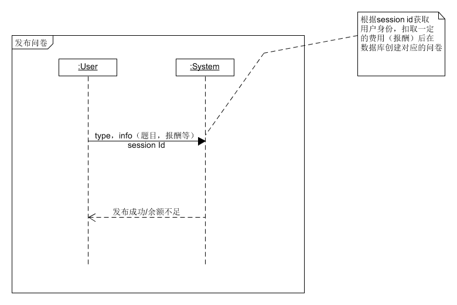
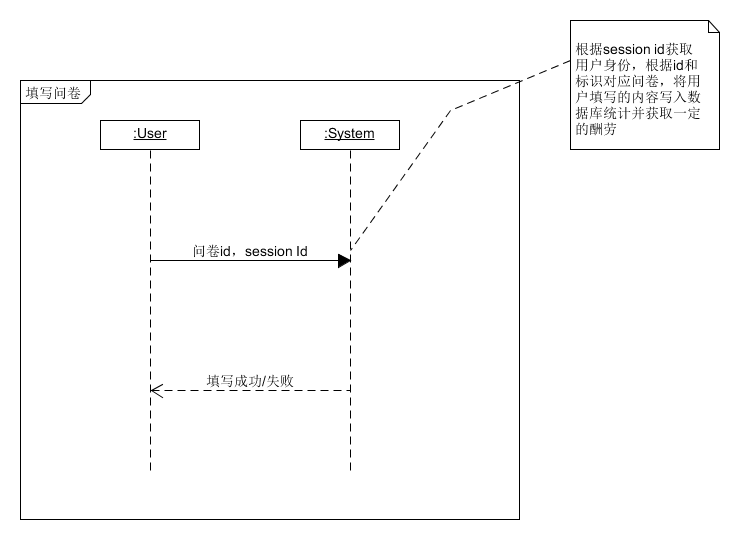
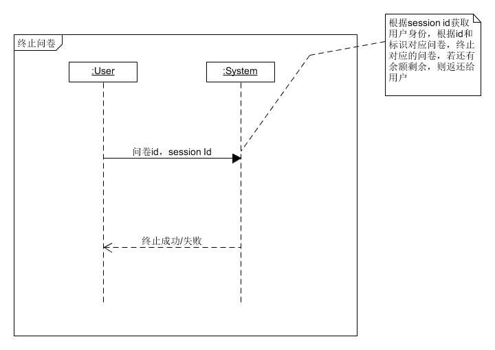

# System Sequence Diagram

[TOC]

# 用户模块

## 用户注册

## 用户登陆

## 验证用户信息

用户提交自己的信息来通过平台的验证，通过验证后才可以使用平台的功能

## 管理员审核

管理员根据提供的消息验证用户身份

# 订单模块

## 发布订单

用户发布订单并扣取一定的费用（给接单者）

## 接受订单

用户接受订单并开始执行任务

## 完成订单

完成订单后，该订单扣取的费用发送给接单者

## 删除订单

用户可删除到达， 包括完成订单后的删除和未接单状态下的订单

# 问卷模块

## 发布问卷

发布问卷，根据数量和单价扣取费用，可选择任意题型：单选，多选和填空

## 填写问卷

个人用户填写问卷，获得报酬

## 问卷统计

用户可以获得问卷的填写情况——填写份数和各个题目的填写情况（百分比，填空题的所有内容）

## 终止问卷

用户如果觉得问卷数量已满足，且不用达到预定的数量，可以提前终止问卷

