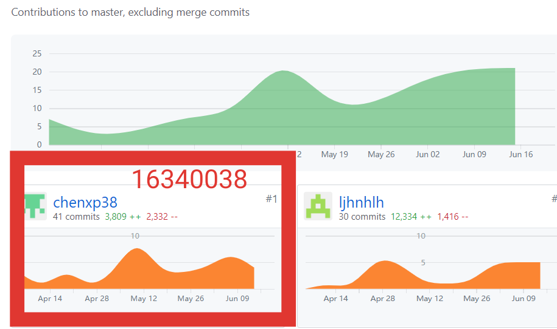

# 16340038-chenxp38 Final Report

## 简短的课程学习自我总结

- 在前期的调研时，需要保持样本的客观性和覆盖面，我们在调查时考虑了Android和苹果两个系统商店的产品，问卷调查需求时找了不同学校不同专业的同学，得知接近真实的客户需求，以便针对性去满足需求。
- 前端开发时各种文档相当重要：微信平台的开发文档和后端同学写的接口文件，前者让我更容易用好相应的技术，后者让我在前后端交互时有一个清晰的逻辑，写起代码来轻松很多。
- 写文档时一开始存在格式不规范，阅读存在难度的问题，在组长的建议下看了一些如会议记录、调研报告的模板，学习去写得更简洁直观，后面写文档时也多参照优秀案例的文档格式。
- 在GitHub的管理上，安排专门的人对小组仓库管理要比把所有组员添加为仓库管理员要好：防止错误的操作，所有人一起管理时容易出现失误改了别人部分的内容。并且在分工时，每个人负责一定的模块也更好的管理，避免冲突。
- 感谢组员们的理解和合作：感谢，ljhnhlh是组长，除了负责艰难的模块还会给我进行答疑并且推荐一些好的学习方法。wakaka001负责后端也同时管理GitHub仓库，处理我们弄出来的冲突。Chenhg8是UI设计师，感谢他的设计，我们的界面看起来美观很多并且界面做起来也容易。还有Linjzh9和linzhk5，我们在写前端时有问题他们会帮我看，并且会分享博客给我。非常感谢！

## PSP2.1 表格

| PSP阶段                    | 耗时(h) |
| -------------------------- | ------- |
| **计划**                   | **4**   |
| · 估计任务时间             | 4       |
| **开发**                   | **80**  |
| · 分析需求                 | 5       |
| · 生成设计文档             | 0       |
| · 设计复审                 | 0       |
| · 代码规范                 | 2       |
| · 具体设计                 | 0       |
| · 具体编码                 | 60      |
| · 代码复审                 | 8       |
| · 测试                     | 5       |
| **报告**                   | **10**  |
| ·测试报告                  | 4       |
| ·计算工作量                | 1       |
| 事后总结，提出过程改进计划 | 5       |
| **合计**                   | **94**  |

## 个人分支的GIT统计表

## 工作清单

- 前端任务发布和表白墙发布的编写：在与后端交互的部分学到了很多知识
- 记录会议内容：把记录写的直观
- 调研报告
- 用例+活动图
- 补充需求说明

## 博客笔记

[系分小组项目踩坑笔记](<https://blog.csdn.net/daxiandan/article/details/89838472#612__46>)

