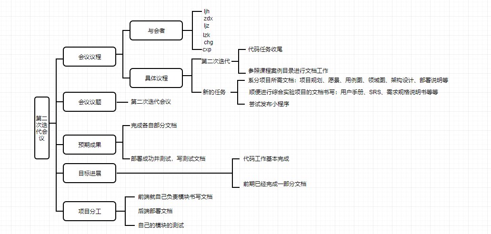

# 1.会议议题:出了什么问题

第二次迭代会议，完成代码部分，下一周期进行文档工作

# 2.信息分享：问题的现状和资源情况

上一周的代码任务基本完成

# 3.方案讨论：问题的解决提案以及决策

- 文档需求工作：按照课程网站所给目录
  - 项目规划（各个迭代所做内容）
  - 产品特性，愿景
  - *需求规格说明（重点写）
    - 用例图：前端根据自己部分写
    - 领域图，活动图，领域模型，状态模型等同上，要求足够详细
    - 测试：简单测试（前端跳转等测试，后端数据）
  - 代码规范网络搜索
  - API设计规范
  - 架构设计
  - 部署说明：后端说明部署方法，前端，看看能不能发布
- 综合实验文档
  - 《用户手册》/《使用说明》 
  - 后端写一下部署说明，前端各自写自己的部分
  - SRS
  - 具体要求看Syllabus.pdf
  - 文档书写周期暂定一周，下周末

# 4.执行分工：确认分工和执行负责人

- 用例图，领域模型、活动图、状态模型等：前端人员根据自己的模块完成，写上基本要点
- 测试：进行一些简单的测试
  - 前端：跳转等一些功能测试
  - 后端：数据简单测试
- 代码规范：参照案例
- API设计规范，架构设计
- 部署说明：后端的部署说明，如果能发布，打算提供二维码
- 用户手册/使用说明：暂未确定形式：若能发布，可直接运行，或ppt等其他形式，使用说明根据各自开发部分进行说明

# 5.思维导图

