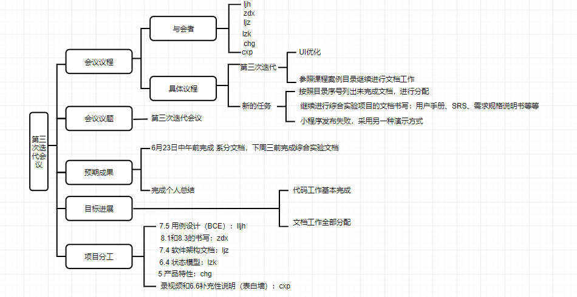

# 1.会议议题:出了什么问题

- 代码工作基本完成，接下来完成UI优化和写文档

# 2.信息分享：问题的现状和资源情况

- 不同机型的屏幕大小不一致导致的界面问题——将长度改成自适应的
- 3前期调研+6.2 完成——cxp
- 6.1 ljz已完成
- 6.3, 6.5已写——ljh
- 7.1UI设计已完成——chg
- 7.2 数据库ER图已完成
- 7.3 API设计，已完成
- 8.2 已完成——zdx
- 小程序风格不统一，需要改一改——主要是颜色
- 闲置接单显示界面的时间的显示问题（发布只上传了年月日，需要处理时分秒的显示）

# 3.方案讨论：问题的解决提案以及决策

- 说一下各自要写的

  - 6.6补充性说明（表白墙）- cxp
  - 6.4状态模型——lzk
  - 7.5 用例设计（BCE）——ljh
  - 5产品特性——chg
  - 8.1xx代码规范——zdx
  - 4项目愿景补充（亮点与特点）——chg
  - 7.4 软件架构文档——ljz
  - 8.3 逻辑架构到应用程序映射指南——zdx
  - 前端部署（发邮件体验）
  - 用户手册（前端每个人对于自己的页面功能进行说明）

- 团队组建：

  - 参照课程案例角色名称确定自己的角色，完成团队组建——已完成

- 王青老师：

  - 测试——参照课程案例
  - SRS，
  - 贡献说明——参照“baoleme”案例的贡献说明
    - 测试分到开发
    - 文档按照分配的工作来分
    - 代码按照模块来分
    - 贡献按照模块（发布，接受，问卷……）分配分数
    - 其他贡献（占座，记录等）的分配

  

# 4.执行分工：确认分工和执行负责人

- DDL：17周周末 查漏补缺 是否线下会议待定
- 下周五之前发给pml
- 下周三结束综合实验和系统分析项目
- 录制视频后上传B站
- 每个人看看自己的代码与说明架构符合（参照往年案例）
- 
- ljh：
  - 7.5 用例设计（BCE）
- zdx：
  - 8.1 xx代码规范
  - 8.3 逻辑架构到应用程序映射指南
- ljz：
  - 7.4 软件架构文档
- lzk：
  - 6.4 状态模型
- chg：
  - 5 产品特性
- cxp:
  - 6.6补充性说明（表白墙）

# 5.思维导图

