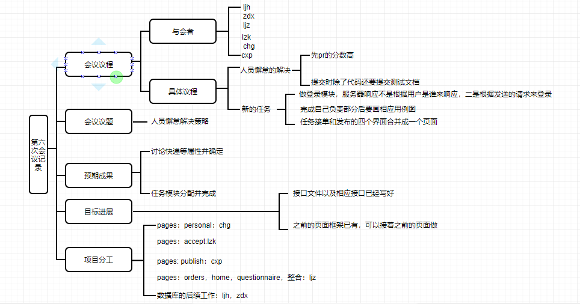

# 1.会议议题:出了什么问题

- 人员懈怠

# 2.信息分享：问题的现状和资源情况

- 项目规划（新）

# 3.方案讨论：问题的解决提案以及意见

- pr先后分配分数，先pr的分数高

- 提交时不仅要提交代码，还要提交测试文档

- 往后两周开一次会议，每次会议进行一次迭代，两个星期中可以进行一些线下讨论

- 本次迭代的是登录模块

- 服务器响应不是根据用户是谁来登录，而是根据发送的请求来登录

- 完成自己负责部分后，需要把用例图画好

- 局域网内可以进行前后端的通信，测试的时候可以用这样的方式

- 前端的界面的逻辑边界面边做逻辑
- 进行整合，GitHub上建立一个目录，然后前端分别将页面pr上去整合
- 考虑到页面数量的闲置，原先接单、发布的四个页面整合成一个页面按照页面号显示
- json格式前端人员之间要相互协调（如快递有什么属性，什么数据格式）

# 4.形成决议：做出方案决策

- 下一次迭代的DDL：5月15日
- 快递属性：快递件数，快递说明以及备注，快递重量，报酬，取快递点，收件地址，送达期限，图片(可以直接上传)
- 闲置属性：图片(可以直接上传），物品名称，物品类别，物品价格（原价，现价），交接形式，描述
- 求助：求助标题，具体内容，图片
- 代购（跑腿）：商品名称，收货地址，购买地址，跑腿费，商品价格，送达期限
- 问卷就是一个json格式的文件，问卷先做四个选项，先不做动态选项，先定选择、填空两种类型

# 5.执行分工：确认分工和执行负责人

- 前端整合目录分配：

  - pages：personal：chg
  - pages：accept:lzk
  - pages:  publish：cxp
  - pages：orders，home，questionnaire，整合：ljz

  ​	

- 后端工作：继续数据库的工作

# 6.思维导图

