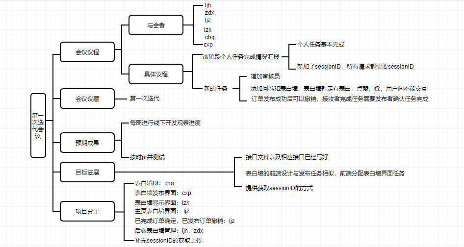

# 1.会议议题:出了什么问题

- 第一次迭代

# 2.信息分享：问题的现状和资源情况

- 第一次迭代任务已经进行了两个星期

# 3.方案讨论：问题的解决提案以及意见

- 第一次迭代的问题：
- 各自说明自己负责任务实现的情况
  - lzk：问卷UI没弄，其他基本完成
  - chg：还未测试
  - cxp：功能基本实现，
  - ljh：接口文件已基本实现
  - zdx：接口文件已基本实现
  - ljz：
- 每个请求都需要sectionID，所以还需要弄这个sectionID
- 第二次迭代：
  - 管理迭代，后端审核，超级管理员
  - 问卷
  - 表白墙任务，点赞和踩（无限次），表白墙用户不能交互
  - 前端后端分一分表白墙的任务，UI设计：chg
  - 第一次迭代在讨论之后的完善日期的确定
  - 每周两次线下开发，视进度看是否开迭代会议
  - 每周日pr，ljg和ljz宿舍测试
  - 需要提交测试文件
  - 发布订单之后有撤销
  - 订单完成后确认

# 4.执行分工：确认分工和执行负责人

- sectionID的补充：前端人员

- 后端审核：ljh，zdx

- 表白墙UI设计：chg

- 表白墙前端设计：cxp,lzk，ljz

- 表白墙后端：zdx，ljh

- 撤销已发布订单：ljz

- 确认已完成订单：ljz

  

# 5.思维导图

