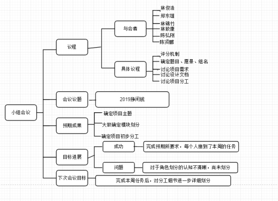

# 项目启动及第一次会议记录

## 议程
2019/03/24 19：00-20：20
- 会议目标
	- 确认组名以及项目愿景	
	- 完成分工
	- 定义产品的业务范围，包括基本业务，创新业务，辅助业务
- 个人任务
	- 小组成员需完成自己的学习文档，记录自己的学习记录，可作为项目技术报告中的一部分。
	- 每星期一次例会，没有讨论内容就一起打代码，以保证效率，有特殊情况另外讨论
- 会议评分机制
	- 百分制，每人基础十五分，剩余十分用于激励主动承担工作  

## 讨论结果
- 分工
	- 框架：ljh
	- 需求分析：ljz
	- 后端工作准备：ljh，zdx
	- 产品前期调研，调研后报告：cxp，lzk
	- UI：chg
	- 会议记录以及思维导图：cxp
	- 相关技术博客视频链接搜集：lzk
- 产品相关
	- 组名
		- 闲钱汪，UI以狗为主题
	- 项目愿景
		- 让天下没有穷人，走向富贵的第一步
	- 业务范围
		- 大学城的大学生
	- 核心要务
		- 兼职平台/兼职中介
	- 基本业务
		- 跑腿，二手，求助，寻组队，代购
	- 创新业务
		- 维系感情，悄悄话，告白墙，夸夸墙等类似的
	- 辅助业务
		- 智能推荐系统(发布任务的时候，进行发布的任务的分类，根据点击量进行排列推荐给用户)

