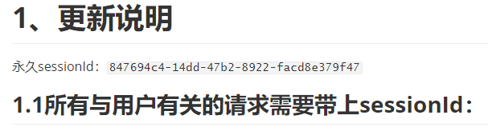

# 接口 API 设计

## API地址

[API地址](https://moneydog.club:3030/swagger-ui.html#/)

## 接口文件

因为我们是基于敏捷开发方法，且进行了多次迭代，所以对接口文件进行了迭代式修改，

因为进行的多次的更新，但大部分的内容没有很大的变化，所以在1.2以后的版本中添加了 **更新说明**，便于开发人员阅读，降低时间开销：

接口文件如下

- [接口文件](./接口文件.md)

- [接口文件1.1](./接口文件1.1.md)

- [接口文件1.2](./接口文件1.2.md)

- [接口文件2.2](./接口文件2.2.md)

- [接口文件2.3](./接口文件2.3.md)

- [接口文件2.4](./接口文件2.4.md)

- [接口文件2.5](./接口文件2.5.md)

- [接口文件2.6](./接口文件2.6.md)

- [接口文件2.7](./接口文件2.7.md)

