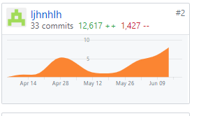

# Final Report

16340140 - ljhnhlh

## 自我总结

这学期以PM和后端java工程师的身份参与了项目的开发，我感觉收获很多，第一次以小组为嘚开发一个完整的产品，实属不易，其中出现了很多的问题，如需求不明确，小组积极性不高等，但庆幸组员们都很配合，在为前端提供了接口文件后，开发也是越来越顺利，最后我们用了2~3个迭代完成整个项目的开发，项目的进度也是平稳有序，不像其他组一样在期末的时候才焦急地赶ddl，此时我们已经完成了全部的任务了，真的很满意。

### PSP 2.1 统计表

|                 PSP2.1                  | Time/h  |
| :-------------------------------------: | :-----: |
|              **Planning**               |  **5**  |
|               · Estimate                |    5    |
|             **Development**             | **40**  |
|               · Analysis                |    5    |
|              · Design Spec              |    5    |
|             · Design Review             |    3    |
|            · Coding Standard            |    1    |
|                · Design                 |    5    |
|              · Code Review              |    2    |
|                 · Test                  |   10    |
|              **Reporting**              | **10**  |
|              · Test Report              |   10    |
|           · Size Measurement            |    4    |
| · Postmortem & Process Improvement Plan |    4    |
|                **Total**                | **109** |

### Git统计报告

### 工作清单

| 最为得意或满意或有价值的事情 |                      简短说明                       |
| :--------------------------: | :-------------------------------------------------: |
|           接口文件           |       将完成并测试好的接口写成文档供前端查阅        |
|      团队管理及会议准备      | 探索一些激励机制提高团队积极性，管理GitHub pr，看板 |
|           编写文档           |                  编写一些设计文档                   |

### 博客清单

- [从后端入手，推动项目开发](https://blog.csdn.net/qq_36303862/article/details/93073185)
- [spring boot 发送 http post 请求](https://blog.csdn.net/qq_36303862/article/details/90899696)
- [spring boot 配置静态资源路径](https://blog.csdn.net/qq_36303862/article/details/89922894)
- [github pull request 协作者视角](https://blog.csdn.net/qq_36303862/article/details/88698179)
- [html 设置button 内文字垂直居中](https://blog.csdn.net/qq_36303862/article/details/90752889)