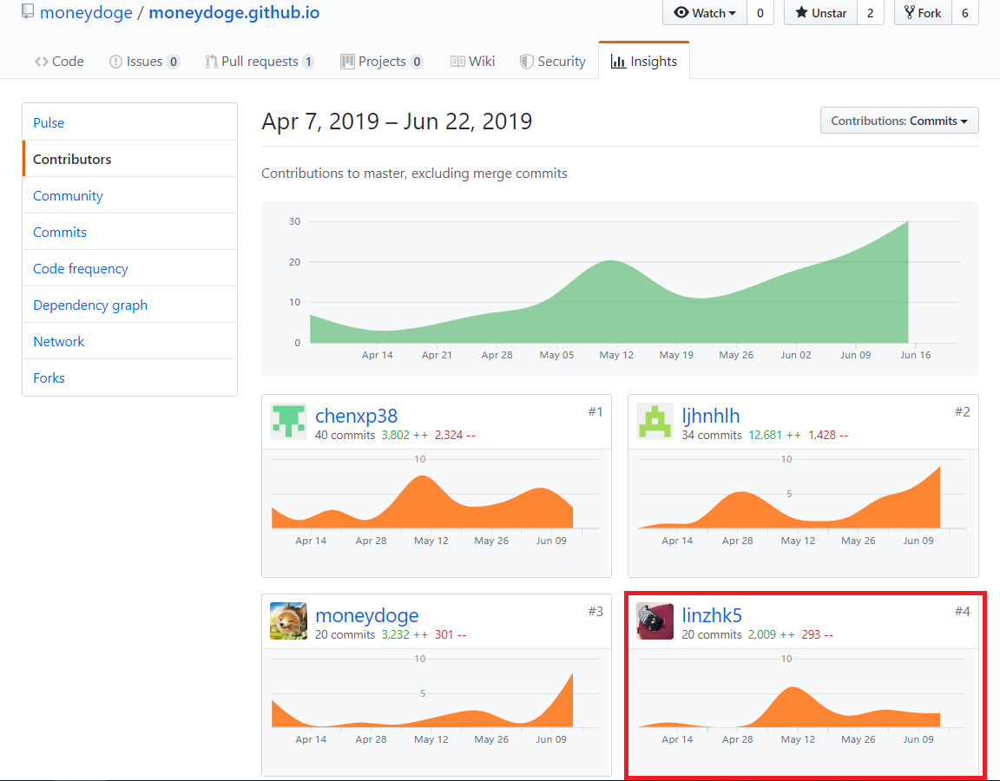

# 课程学习自我总结

这学期的项目我受益良多。我们小组做微信小程序开发，微信小程序虽然被很多程序员诟病，但是他还是有许多优点的，首先微信小程序的安装部署很简单，只需要手机上有微信就能打开不需要其他东西；而且微信小程序开发成本低、便于维护。这次项目写了许多的文档，在写文档的过程中巩固了我在课上学到的知识。在GitHub项目管理中我们组长lijhnhlh给了我很大的帮助。

# PSP2.1

| PSP2.1            | Personal Software Process Stages     | Time Senior Student | Time |
| ----------------- | ------------------------------------ | ------------------- | ---- |
| Development       | 开发                                 | 35                  | 36   |
| · Analysis        | 需求分析 (包括学习新技术)            | 6                   | 8    |
| · Design Spec     | 生成设计文档                         | 0                   | 0    |
| · Design Review   | 设计复审                             | 0                   | 0    |
| · Coding Standard | 代码规范                             | 6                   | 9    |
| · Design          | 具体设计                             | 5                   | 6    |
| · Coding          | 具体编码                             | 8                   | 8    |
| · Code Review     | 代码复审                             | 10                  | 10   |
| · Test            | 测试（自我测试，修改代码，提交修改） | 10                  | 10   |
| Reporting         | 报告                                 | 0                   | 0    |

# 个人分支的GIT统计报告

# 自认为最有苦劳的工作清单

将五个接单页面整合到一个页面里，那是真的累，一开始说是要限制小程序页面个数，后面又说不用了，白做了那么多工作。

# 个人技术类、项目管理类博客清单

[技术、项目管理学习](lzk技术学习.md)