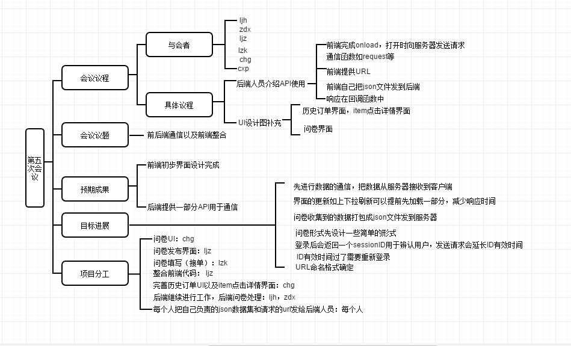

# 1.会议议题:出了什么问题

- 整合前端

- 前后端数据交互

- 功能界面未完善

# 2.信息分享：问题的现状和资源情况

- 上一周前端的界面任务基本完成，会议开始时发现问卷页面等一些界面没有考虑

- 后端已经做好一些API基础，介绍API，说明如何用这些API传送数据流

# 3.方案讨论：问题的解决提案以及意见

- 前后端通信函数介绍，request……

- 前端提供URL等

- 前端自己想json格式的数据，把json文件发给后端人员

- 响应在回调函数

- onload前端自己写，打开的时候向服务器发送请求

- 下拉/上拉请求更新，一次性全部加载对服务器压力很大

- UI的历史订单，还有点击到item的item点击详情界面（UI设计：chg）

- 问卷界面还没弄，并且是必须要做的功能

- 问卷形式，可以考虑在求助等添加，问卷可以在发布，接单页面放置

# 4.形成决议：做出方案决策

- 先把数据拉下来，其余后面再考虑

- 提前加载一部分，以减少响应时间

- 问卷打包成一个json发到服务器

-  问卷UI（chg），问卷发布(ljz)，问卷填写（接单界面）(lzk)

- 为了方便实现，问卷用选择题形式这些简单形式，或者给不同类型的题型，赋值不同的tap

- 登录后，服务器返回对话id（sessionID），用来辨认用户，对话id存在全局变量或者写入本地内存

- 前端整合：首先将文件夹名更改以免冲突，先整合看有无问题，没问题再分别上传GitHub

-  登录时，login请求后，header有一个sessionId，每次发送请求，就会延长session的有效时间。如果领取任务时sessionId过期了，那么要求再次登录，登录时就能更新sessionId

- URL格式如：www.runoob.com/ljz/dingdan/kuaidi   就是在后面自己可以根据自己负责的模块命名

- 根据后端数据库表发给前端用于命名变量，方便整合

# 5.执行分工：确认分工和执行负责人

- 完善历史订单UI以及item点击详情界面：chg

- 问卷UI：chg

- 问卷发布界面：ljz，

- 问卷填写（接单）：lzk

- 整合前端代码： ljz

- 后端继续进行工作，后端问卷处理：ljh，zdx

- 每个人把自己负责的json数据集和请求的url发给后端人员：每个人（自己要交互的信息写成json格式发送到服务器（后端）），

  # 6.思维导图

  

