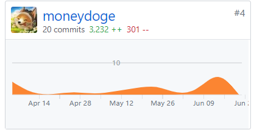
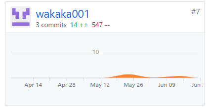

## Final Report
16340303-wakaka001
#### 自我总结
本次项目开发，我以java后端工程师进行开发。感觉现在开发的难度真的不高，网上有很齐全的教程，哪个不会google一下基本就有解决方案了。

#### PSP 2.1 总结表
|PSP阶段|耗时|
|---|---|
|**计划**|5|
|**开发**|50|

| PSP阶段                    | 耗时(h) |
| -------------------------- | ------- |
| **计划**                   | 5  		|
| **开发**                   | 50  		|
| · 分析					 | 5		|
| · 设计					 | 6		|
| · 设计复审				 | 1		|
| · 代码规范				 | 1		|
| · 具体设计				 | 2		|
| · 具体编码				 | 20		|
| · 代码复审				 | 5		|
| · 测试					 | 10		|
| **报告**					 | 11		|
| · 测试报告				 | 10		|
| · 计算工作量				 | 1		|
| **总计**					 | 66		|

#### Git统计报告
由于帐号切换问题，moneydoge和wakaka001都属于同一个人所有
    

  

#### 工作清单
- 完成对服务器的部署（不足的是，在最后才看到可以使用docker进行部署，我们采用的是spring boot自带的tomcat进行的部署，因此缺失了一定的便捷性）
- 编写生产规范与指南

#### 博客清单
[已经写在X4 Tech/Work Report中](page/zdx_note.md)